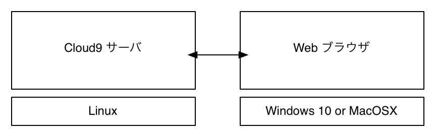
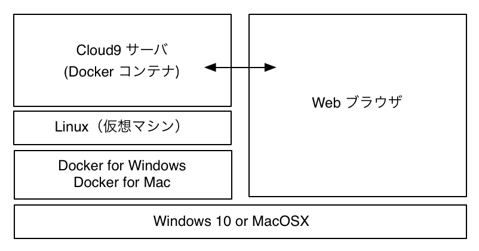

<!-- footer: ソフトウェア工学　2018年度版-->
<!-- page_number: true -->

# Docker のインストール

---

## Docker とは

Docker社が開発しているコンテナ型の仮想環境を作成・配布・実行するためのプラットフォームです．

https://www.docker.com/what-docker

## Dockerの仮想環境

- 仮想環境：OS上で別のOSを実行する
	- 例：VirtualBox, VMware, etc.
- コンテナ型の仮想環境
	- ホストマシンのカーネルを利用し，プロセスやユーザなどを隔離することで別のマシンが動いているかのように動かす
	- 軽量かつ高速
	- Dockerでは Linux のコンテナ技術を利用

---

## Dockerの特徴

- Infrastracture as Code
	- インストールや各種環境設定をコード化して管理
- コード化されたファイルを共有することで同じ環境が作れる
- 単なるコードなので環境を配布しやすい
- スクラップ＆ビルドが容易
- 今後（既に？）ソフトウェア開発現場で多く利用される

---

## Docker のインストール

### Windows 10

- http://www.atmarkit.co.jp/ait/articles/1609/01/news053.html
- [Qiitaの記事](https://www.google.com/url?sa=t&rct=j&q=&esrc=s&source=web&cd=1&ved=0ahUKEwik--32w8DbAhVIfbwKHeQ7BaQQFggoMAA&url=https%3A%2F%2Fqiita.com%2Fchr%2Fitems%2F184b6af37d105bdad145&usg=AOvVaw0rZUIlwJ01vYWJORtitN05)
	- 上記記事の「docker-composeを使ってnginxからローカルのファイルを表示する」の手前まで

### Windows 10 以前

- できれば Windows 10 にしてください．

### MacOSX

- [Qiitaの記事](https://qiita.com/hogehoge1234/items/7c73be819295d183aa5b)

---

## 授業で使う環境のセットアップ

1. 下記 URL から ZIP ファイルをダウンロードして展開する．
   https://github.com/okamumu/c9-ror/releases/latest
1. 展開したフォルダへ CUI で移動．Windows の場合は PowerShell．Mac の場合はターミナル．わからない人は Google it!
1. 以下のコマンドを入力して，しばらく（５分くらい）待つ．
	```sh
	docker-compose up -d
	```
1. 以下のコマンドを入力して
	```sh
	docker-compose logs
	```
	以下のメッセージが表示されていればOK（`docker-compose logs`は何度実行しても問題ない）
	```sh
	Starting Cloud9 service for cloud9 云々..
	```

---

## 利用方法

1. `docker-compose up -d` が成功した人はブラウザから http://localhost:8199 にアクセスする．
2. Cloud9 の画面が出てきてユーザとパスワードを聞かれるので以下を入力する．
    - ユーザ名: cloud9
    - パスワード: cloud9
3. 詳細な使い方は講義で使うときに説明します．

---

## 補足

- Docker の仮想コンテナ上で Cloud9 サーバを起動しています．
- Cloud9 はクラウド型の統合開発環境で，Web ブラウザを経由してサーバにアクセスします．8199 はポート番号です．
- 初回の `docker-compose up -d` で同フォルダに c9home と workspace が作成されます．
	- c9home: Cloud9 のサーバプログラム自身が格納されます．
	- workspace: Cloud9 上でプログラムを作成したりする際の作業スペースです．
- c9home に Cloud9 のサーバプログラムをインストール（コンパイル）するため初回だけ時間がかかります．

- c9home が初回に作成されるため二回目以降の `docker-compose up -d` の起動は速くなります．

---

### 補足説明：Cloud9

- Cloud9サーバを起動している Linux マシンのファイルを Web ブラウザ経由で編集できる．
- Cloud9サーバを起動している Linux マシンのターミナルを Web ブラウザで操作できる．

→Linux環境をWebブラウザ経由で利用できる．



---

### 補足説明：Clound9 on Docker

- Dockerコンテナとして自分のマシンで Cloud9サーバを起動
- Webブラウザから自分のマシンで動いているCloud9サーバにアクセス

→ 外部サーバに頼ることなくローカルにLinux環境を構築できる



---

## 後始末

- 起動したときと同様にフォルダへ CUI で移動し，以下のコマンドを打つ．
  ```sh
  docker-compose down
  ```
- 停止したら Docker を止めて良い．
- マシンパワーが気にならなければ動かしっぱなしでも良い．
- Docker は基本自動起動なので気になる人は自動起動を切っておく．
