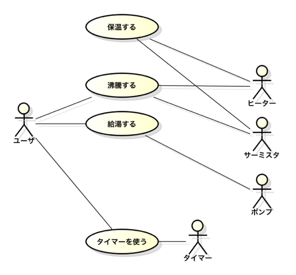
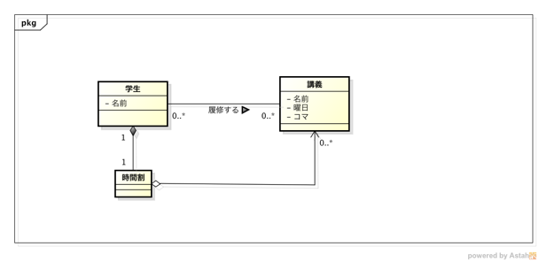
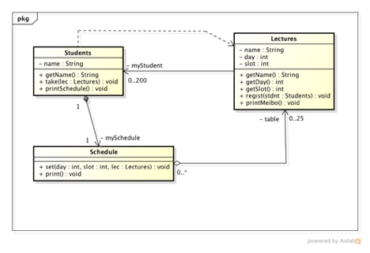

<!-- footer: ソフトウェア工学　2018年度版-->
<!-- page_number: true -->

# ソフトウェア工学　ガイダンス

- この講義ではグループにわかれて受講します．Bb9 「ソフトウェア工学2018」の「グループ分け」および「座席表」を参考にしてグループ単位で着席してください．
- この講義では必携PCを利用しますので準備してください．
- 講義は 13:20 から開始しますので以下を済ませておいてください．
	- グループ内での自己紹介
  - 環境構築（Bb9 の「Docker」を参照
	  - 見てとりあえず１名のPCに構築
	  - つまったら教員とTAへ気軽に聞いてください．

---

# この講義で学ぶこと

- 領域：SE (Software Engineering)   ※多くの講義は CS (Computer Science) 領域
- 知識
	- 典型的なソフトウェア開発工程を理解する
	- 各工程でやること（作業項目）を理解する
		- 難しさ＆気をつけるべきこと
- 技術（スキル）
	- ソフトウェア設計の概要
	- UMLの記述
	- オブジェクト指向プログラミング
	- オブジェクト指向設計

---

---

---

# 対象受講生と講義資料

- 対象
	- 工学部第二類の情報工学課程（必修）
	- 将来システム開発を目指す人（コンサル，PM）
- 講義資料
	- 教科書は指定しない
	- 参考書：Java, UML に関する書籍
	- 講義スライド（Bb9 に掲載）
	- 講義ノート（Bb9 に掲載）
	- 講義室ではノートPC，タブレットPCで閲覧を推奨

---

# 成績評価

- 期末試験（中間試験？）
	- ソフトウェア開発に関する知識
	- オブジェクト指向設計に関する問題
	- Java，UML　
- グループ課題
	- グループによる提出物
	- 個人による提出物

---
# 他の授業との関係

---

# 講義予定

- 6/11 Mon. ソフトウェア工学概論
- 6/18 Mon. オブジェクト指向プログラミング
- 6/25 Mon. ソフトウェア設計
- 7/2 Mon. ソフトウェア要求
- 7/9 Mon. オブジェクト指向設計
- 7/13 Fri. プロジェクト管理／ロジカルシンキング
- 7/23 Mon. ソフトウェア品質・レビュー
- 7/30 Mon. ふりかえり・まとめ／期末テスト

