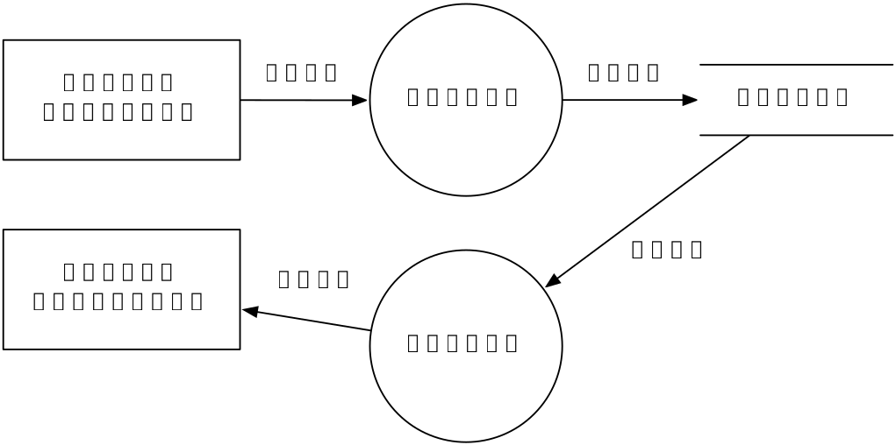
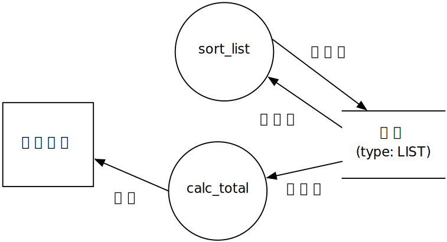

<!-- footer: ソフトウェア工学　2018年度版　第3週-->
<!-- page_number: true -->

- 講義は 13:20 から始めます．
- Bb9 資料の Cloud9 を見て環境を整えておいてください（「学内の端末利用」は内容をアップデートしています）．
- 共通例題（misc/common_example.md）を C 言語と Java 言語を使って，それぞれ C 言語版，Java 言語版としてプログラミングしてください．
- note_week3.docx または note_week3.md をグループで提出してもらうのでグループで事前に打ち合わせをしておいてください．

---

# 第3週：ソフトウェア設計図

## DFD
## フローチャート，UMLアクティビティ図
## UMLクラス図
## UMLシーケンス図

---

# 課題

### note_week3.docx または note_week3.md をグループで分担して作成して Bb9 を通じて提出せよ．

---

# 第3週：ソフトウェア設計図

## **DFD**
## フローチャート，UMLアクティビティ図
## UMLクラス図
## UMLシーケンス図

---


# 設計における二つの視点（再掲）

## 構造視点（静的視点）：アーキテクチャ設計

- ソフトウェアがどういった部品（component）から構成されるか
- コンポーネントとそれらのインタフェースを決める
- ソフトウェアを分割して部分要素群を設計する（サブシステム分割，モジュール分割）

## 動作（behavior）視点（動的視点）

- ある処理を実現するためにコンポーネントがどのように動作するか
- コンポーネント間のやりとりを決める→大まかなプログラミング
- コンポーネント内の処理を決める→ほぼプログラミング

---

# 設計における大まかな流れ

**大きなものから小さなものへ**

- モジュール分割とモジュール間フローの設計
	- ドメインにおける言葉でモジュールを設計
		- 例：帳票，精算，伝票，etc.
    - モジュール間の処理フローを設計
- プログラミングモジュールの設計
	- プログラミングの観点でモジュールのラベルを設計<br>（関数，メソッド名，変数名の設計）
	- 各モジュールの処理を設計

---

# 今日のゴール

- 設計図の読み方・書き方
- C / Java 言語との対応
- **設計方法は第5週に行う**予定

---

# DFD: Data Flow Diagram

- システムにおけるプロセス（処理）とプロセスへのデータの入出力を記述する．
- 処理タイミングや条件などを表すものではない（静的視点）
- コンポーネント（構成要素）
  - プロセス（丸）：入力データを加工して出力
  - データストア（平行線）：データの保持
  - エンティティ（四角）：システム外部（データの発生／行き先）
  - フロー（矢印）：データの移動

---



---

## ルール

- 処理は少なくとも１つの入力データフローと１つの出力データフローがなければならない
- データストアは少なくとも１つのデータフローがなければならない
- 外部エンティティは少なくとも１つのデータフローがなければならない
- データフローは少なくとも１つの処理に結びつかなければならない

---

## プログラミング言語（C言語）との対応

- 初期 DFD （**概念DFD**）におけるラベルはドメインにおける言葉で記述
	- 帳票処理，精算，伝票，etc.
- 分解が進んだ後の最終 DFD （**詳細DFD**）はプログラミングにおける言葉で記述
	- `sort_list`, `display_total`, etc.
	- 一つのプロセスが一つの関数に対応
	- データストアはグローバル／ローカル変数に対応（変数スコープには言及していない）
	- データフローは引数（値渡し or 参照渡し）と戻り値に対応
- プロセス内の動作はフローチャートなどで作成

---

```c

typedef LIST ....

/* prototype */
void sort_list(LIST *list);
int calc_total(LIST *list);
```



---

# 第3週：ソフトウェア設計図

## DFD
## **フローチャート，UMLアクティビティ図**
## UMLクラス図
## UMLシーケンス図

---

# UML

- UML（Unified Modeling Language，統一モデリング言語）
ソフトウェア設計のための図

### 構造図

- **クラス図**，コンポーネント図，配置図，オブジェクト図，パッケージ図

### 振る舞い図

- **アクティビティ図**，ステートマシン図，ユースケース図，相互作用図（**シーケンス図**，コミュニケーション図，etc.）

---

# フローチャート/UMLアクティビティ図

- 作業手順をステップ毎の記号で表す．
- UMLアクティビティ図はフローチャートの拡張

- アクション／アクティビティ（action / activity）
	- 原子的な振るまいをアクション．一連の振るまいをアクティビティと呼び，角を丸くした四角で表現する．
- 開始ノード（initial node）
	- アクティビティの開始を表すノード．黒丸で表現する．
- アクティビティ終了ノード／フロー終了ノード（activity final node / flow final node）
	- アクティビティまたはフローの終了を表すノード．二重丸やバツ丸で表現する．

---

- コントロールフロー（control flow）
	- 処理の流れを表し，アクション／アクティビティをつなぐ矢印で表現する．
- デシジョンノード／マージノード（decision node / merge node）
	- 条件によるフローの分岐と集約を表す．白抜きのひし形で表現する．
- フォークノード／ジョインノード（fork node / join node）
	- 並行作業への分割と統合を表す．太い直線で表現する．
- アクティビティパーティション（activity partition）
	- アクティビティを実行する主体やフェーズでアクティビティ図の要素をまとめる．アクティビティ図を垂直・水平方向に区切るパーティションで表現する．

---

```uml
@startuml
scale 2
skinparam shadowing false

|Main system|
start
:アクション1;
:アクティビティ2;
note right
アクションとアクティビティは
区別できないので別ACTを作るだけ
endnote
if () then (正常)
|Sub system|
	:アクション3;
    fork
      :アクション4;
    note left
    分岐中
    endnote
    fork again
      :アクション5;
    endfork
|Main system|
else (エラー)
  stop
endif
|Sub system|
end

@enduml
```

---

## プログラミング言語（C や Java）との対応

- 様々な記述レベルで利用される．
	- ドメインにおける言葉でビジネスフロー
	- ステートメントレベルでほぼプログラム
- ステートメントレベルではプログラムと一対一で対応する．

---

```uml
@startuml
scale 2
skinparam shadowing false

start
:x = 10;
:y = 5;
if (x==0) then (true)
	:printf("%d\\n", x);
else (false)
	:printf("%d\\n", y);
endif
end
@enduml
```

---

```c
x = 10;
y = 5;
if (x == 0) {
  printf("%d\n", x);
} else {
  printf("%d\n", y);
}
```

---

# 第3週：ソフトウェア設計図

## DFD
## フローチャート，UMLアクティビティ図
## **UMLクラス図**
## UMLシーケンス図

---

# UML クラス図

- **クラス間**の静的（static）な関連

### 基本コンポーネント

- クラス
- 関係
  - 関連
  - 集約
  - コンポジション
  - 汎化
  - 依存

---

## オブジェクト指向プログラミングのおさらい

### 基本概念

- クラス：抽象化されたモノ
- オブジェクト：モノの実体（実体化をインスタンス化と言う）

#### 例
- 「山田：学生」オブジェクトは学生クラスをインスタンス化
- 「ソフトウェア工学：講義」オブジェクトは講義クラスをインスタンス化

---

## クラス (Class)

- クラス（≠オブジェクト）を長方形で表現
- 区画を分けて「属性」と「メソッド（操作）」を表現する
  - 属性：オブジェクトが知っていること．持っている情報
  - メソッド：オブジェクトができること

```uml
@startuml
skinparam shadowing false
scale 2
hide circle

class "学生" {
  属性1
  属性2

  操作1(引数1, 引数2)
  操作2(引数1, 引数2)
}

@enduml
```

```uml
@startuml
skinparam shadowing false
scale 2
hide circle

class "学生" as s {
}

note right of s 
属性や操作がなくても必ず区画をつける
（ローカルルール）
endnote
@enduml
```

---

### 属性や操作における表現

- 「型」は後ろにコロンをつけて記述
- 属性や操作のついての可視性は以下の通り

|可視性|内容|
|--|--|
|`+`|全てにおいて参照可能（public）|
|`-`|自クラスでのみ参照可能（private）|
|`#`|自クラス及びその派生クラスにおいて参照可能（protected）|
|`~`|同一パッケージ内で参照可能（package）|

```uml
@startuml
skinparam shadowing false
scale 2
hide circle
skinparam classAttributeIconSize 0

class "学生" as s {
- 名前:文字列
- 年齢:整数
+ 名前を聞く():文字列
+ 年齢を聞く():整数
}

note right of s
名前や年齢の属性は private
名前を聞く()や年齢を聞く()操作は public
名前と年齢は「文字列」と「整数」型，
名前を聞く()や年齢を聞く()操作の戻り値は「文字列」と「整数」型
endnote
@enduml
```

---

## 関連 (association)

- あるクラスとあるクラスの関連があることを実直線で表す．
- 関連名，役割名，多重度で詳細に表現することもできる．

```uml
@startuml
skinparam shadowing false
scale 1.5
left to right direction
hide circle

class "学生" as s {
}

class "教授" as t {
}

note right of t
学生と教授は関連がある．
endnote
s -- t

@enduml
```

```uml
@startuml
skinparam shadowing false
scale 1.5
left to right direction
hide circle

class "学生" as s {
}

class "教授" as t {
}

note right of t
「教授は学生に講義をする」という関連がある．
endnote
s -- t: "講義をする <"

@enduml
```

```uml
@startuml
skinparam shadowing false
scale 1.5
left to right direction
hide circle

class "学生" as s {
}

class "教授" as t {
}

note right of t
講義における役割は「聴講生」と「講師」
endnote
s "聴講生" -- "講師" t: "講義をする <"

@enduml
```

```uml
@startuml
skinparam shadowing false
scale 1.5
left to right direction
hide circle

class "学生" as s {
}

class "教授" as t {
}

note right of t
多重度（オブジェクト視点）
教授は0人以上の学生へ講義をする
学生は0人以上の教授の講義をうける
endnote
s "0..*\n聴講生" -- "0..*\n講師" t: "講義をする <"

@enduml
```

---

### 関連における表現

- 役割名には「可視性」をつけることができる．
- 多重度における表現は次のとおり

|表現|内容|
|--|--|
|`10`|必ず10|n
|`1..10`|1から10のいずれか|
|`1,5,10`|1,5,10のいずれか|
|`1..*`|1以上|

- 矢印で誘導可能性（navigability）を表現

```uml
@startuml
skinparam shadowing false
scale 1.5
left to right direction
hide circle

class "学生" as s {
}

class "教授" as t {
}

note right of t
教授から学生への一方的なメッセージ
（学生から教授へメッセージを送れない）
endnote
s "0..*\n聴講生" <--- "0..*\n講師" t: "講義をする <"

@enduml
```

---

## 集約 (aggregation)

- 特殊な関係：あるクラスが他のクラスの一部を構成
- Has-A, Part-of 関係「〜が〜を持っている，一部となっている」
	- 「部分」を別のオブジェクト間で共有しても良い
- 終端が菱形の線
- 多重度，ロール名，nabigability も表現可能

```uml
@startuml
skinparam shadowing false
scale 1.5
left to right direction
hide circle

class "学生" as s {
}

class "大学" as t {
}

note right of t
大学は学生を持っている．
学生は大学の構成要素である．
endnote
s ---o t

@enduml
```

```uml
@startuml
skinparam shadowing false
scale 1.5
left to right direction
hide circle

class "学生" as s {
}

class "大学" as t {
}

note right of t
大学は一人以上の学生を持っている．
学生は一つの大学に帰属する．
endnote
s "1..*" ---o "1" t

@enduml
```

---

## コンポジション (composition)

- 強い「集約」関係：「一部でもないと全体が存在できない」
	- 「部分」は複数のオブジェクトで共有しない
- 黒塗りの菱形
- 多重度，ロール名，nabigability も表現可能

```uml
@startuml
skinparam shadowing false
scale 2
left to right direction
hide circle

class "学生" as s {
}

class "大学" as t {
}

note right of t
大学が消えるときは学生も消える．
学生が消えるときは大学も消える．
endnote
s "1..*" ---* "1" t

@enduml
```

---

## 汎化 (generalization)

- オブジェクト指向プログラミングの継承関係
- Is-A 関係「〜は〜である」
- 白抜きの三角矢印
- 多重度，ロール名，nabigability は不要

```uml
@startuml
skinparam shadowing false
scale 2
top to bottom direction
hide circle

class "教職員" as f {
}

class "教授" as p {
}

class "准教授" as ap {
}

note right of f
教授は教職員である
准教授は教職員である
endnote

f <|-- p
f <|-- ap

@enduml
```

---

## 依存

- クラスの責務を果たすために他のクラスに「依存」する．
- 永続的でない「一時的」な関係を表す．
- 点線の矢印＋ステレオタイプ（どちらがどちらに依存しているか明示するため必ず矢印をつける）
- 多重度，ロール名，nabigability は不要

|ステレオタイプ|内容|
|--|--|
|`<<realize>>`|Client が Supplier の実装する（「実現」で説明）．|
|`<<use>>`|ClientがSupplierを使う．|
|`<<create>>`|ClentがSupplierを作成（new）する．|


```uml
@startuml
skinparam shadowing false
scale 1.5
left to right direction
hide circle

class "Client" as c {
}

class "Supplier" as s {
}

note right of s
Clientの実装はSupplierに依存している．
endnote
c ..> s: "<<stereotype>>"

@enduml
```

---

## 実現 (realization)

- 特殊な汎化＆依存
- `<<realize>>` のステレオタイプがついた依存
- 実装を派生クラスにまかせたインターフェイス（能力）の継承
- Javaにおける `implements` による継承
- 多重度，ロール名，nabigability は不要

```uml
@startuml
skinparam shadowing false
scale 2
left to right direction
hide circle

class "ConcreteClass" as c {
}

class "<<interface>>\nInterface" as s {
}

note right of s
ConcreteClassはInterfaceのインタフェースを
継承して，その実装を行う．
endnote
c ..|> s

@enduml
```

---

## プログラミング言語（Java）との対応

- 初期はドメインにおける言葉（概念クラス図）
- 最終はプログラミングにおける言葉で記述（詳細クラス図）
	- クラス名 :arrow_right: Java クラス名
	- 属性 :arrow_right: Java フィールド変数名
	- 操作 :arrow_right: Java メソッド名
	- 関連・集約・コンポジット
		- ロール名 :arrow_right: Javaフィールド変数名
		- 多重度 :arrow_right: 配列など
	- 汎化 :arrow_right: `extends` による継承．
	- 実現 :arrow_right: `implements` による実装
	- 依存に対応するJavaコードはない（new や引数となる）

---

```uml
@startuml
skinparam shadowing false
scale 2
left to right direction
hide circle

class "Students" as s {
  name: String
  entrance: Date
  getName(): String
  getEntranceDate(): Date
  take(lecture: Lectures): void
}

class "TimeTable" as t {
  take(lecture: Lectures): void
}

class "Lectures" as l {
  name: String
  getName(): String
  regist(student: Students): void
}

class "Meibo" as m {
  check(student: Students): boolean
  regist(student: Students): void
}

s o-d-> "1\n myTimeTable" t
l o-d--> "1\n myMeibo" m
t -r-> "0..*\n lectures" l
s "0..*\n listener" <-r- m

@enduml
```

---

```java
class Students {
  String name;
  Date entrance;
  TimeTable myTimeTable; /* 関係から */
  String getName() {}
  Date getEntranceDate() {}
  void take(Lectures lecture) {}
}

class TimeTable {
  Lectures[] lectures; /* 関係から */
  void take(Lectures lecture) {}
}
```

---

```java
class Lectures {
  String name;
  Meibo myMeibo; /* 関係から */
  String getName() {}
  void regist(Students student) {}
}

class Meibo {
  Students[] listener; /* 関係から */
  boolean check(Students student) {}
  void regist(Students student) {}
}
```

---

```uml
@startuml
skinparam shadowing false
scale 2
left to right direction
hide circle

class "<i>Print</i>" as s {
  <i>print(): void</i>
}

class "PrintHello" as p {
  print(): void
}

s <|-- p

note right of p
オーバーライドする場合は
子クラスの操作に記述する．
オーバーライドしない場合は原則不要．
endnote

note top of s
abstractクラス，
abstractメソッドは
イタリックで表記する．
endnote
@enduml
```


```java
abstract class Print {
  abstract void print();
}

class PrintHello extends Print {
  @Override
  void print() {}
}
```

---

```uml
@startuml
skinparam shadowing false
scale 2
left to right direction
hide circle

class "<<interface>>\nPrint" as s {
  print(): void
}

class "PrintHello" as p {
  print(): void
}

s <|.. p

note right of p
オーバーライドする場合は
子クラスの操作に記述する．
endnote

note top of s
interfaceは
ローマンで表記．
endnote
@enduml
```


```java
interface Print {
  void print();
}

class PrintHello implements Print {
  @Override
  void print() {}
}
```

---

*Exercise: 概念クラス図の演習問題*

---

# 第3週：ソフトウェア設計図

## DFD
## フローチャート，UMLアクティビティ図
## UMLクラス図
## **UMLシーケンス図**

---

# UML シーケンス図

- あるシナリオにおける**オブジェクト間**のメッセージのやりとり
- 時系列による記述
- 構成要素（基本）
  - ライフライン（lifeline）
  - 実行仕様（execution specification）
  - メッセージ（message）
  - 同期，非同期，応答，ファウンド，ロスト
  - 複合フラグメント
	  - ref, opt, alt, loop

---

# ライフライン (lifeline)

- クラスのインスタンス（実体化）とその生存線
- 実際にコラボレーションする「モノ」
- インスタンスがいつ生成されていつ消滅するか
- 表記
  - オブジェクト :arrow_right: 四角
  - 外部エンティティ（アクター）<br> :arrow_right: スティックマン（人型のアイコン）
- ラベル
  - オブジェクト名
  - オブジェクト名：クラス名
  - ：クラス名（無名オブジェクト）

---

# 実行仕様 (execution specification)

- 生成されているライフラインが実行状態である期間
- 実行オカレンス→ライフライン上の長方形

---

# メッセージ

- オブジェクト間で交換される（送受信される）メッセージ
- メソッド（操作）に対応（引数を指定することもできる）
- 表記
  - 黒塗り三角の矢印（同期メッセージ）
	- メッセージの実行が終了するまで次のメッセージは実行されない
  - 矢印（非同期メッセージ）
	- メッセージを送信したら終了を待たずに次のメッセージを実行する
  - 点線矢印（応答メッセージ）
	- メッセージの終了を表す．戻り値があることを明示したい時に使う

---

```uml
skinparam shadowing false
scale 2
hide footbox

actor "ユーザ" as u
participant ":登録処理" as c
participant "山田:学生" as s
actor "Twitter" as t

u -> c: 登録ボタンを押下する()
activate c
c -> s: 名前を取得する()
activate s
s -> s: 文章を作る()
s ->> t: ツイートする()
note right
非同期メッセージのため
応答を待たずに次の処理をします．
endnote
s --> c
deactivate s
c --> u
deactivate c

```

---

# オブジェクトの生成

- 生成メッセージ：ステレオタイプ `<<create>>`

```uml
@startuml
skinparam shadowing false
scale 2
hide footbox

actor "ユーザ" as u
participant ":登録処理" as c
participant ":学生" as s

u -> c: 登録ボタンを押下する()
activate c
create s
c -> s: <<create>>
note right
オブジェクトを表す四角が
生成メッセージのところに来ます．
endnote
activate s
s --> c
deactivate s
destroy s
note right
×印でオブジェクトの消滅を
明示します．
endnote
c --> u
deactivate c

@enduml
```
---

# 複合フラグメント

- 分岐，繰り返しなどの表現する
- シーケンスを四角の枠で囲む

|タイプ|内容|
|--|--|
| `ref` | 別のシーケンス図を参照 |
|`opt` | if文 |
|`alt`| if-then-else文 |
| `loop` | for, whileループ|

---


```uml
@startuml
skinparam shadowing false
scale 2
hide footbox

actor "ユーザ" as u
participant ":登録処理" as c
participant ":学生" as s


u -> c: 登録ボタンを押下する()
activate c
c -> s: 初期化する()
activate s
ref over s : initialize
note right
ref を使って別シーケンスを参照することができます．
endnote
s --> c
deactivate s
c --> u
deactivate c

@enduml
```

```uml
@startuml
skinparam shadowing false
scale 2
hide footbox

participant ":学生" as s

group initialize
[-> s: 初期化する()
s -> s: 名前を登録する()
[<-- s
end
@enduml
```

---

```uml
@startuml
skinparam shadowing false
scale 2
hide footbox

actor "ユーザ" as u
participant ":登録処理" as c
participant ":学生" as s


u -> c: 登録ボタンを押下する()
note right
opt を使って if 文を記述します．
[x != 0] の条件が成り立っていれば
枠内のシーケンスを実行します．
endnote
activate c
opt x != 0
c -> s: 処理する()
activate s
s --> c
deactivate s
end
c --> u
deactivate c

@enduml
```

---

```uml
@startuml
skinparam shadowing false
scale 2
hide footbox

actor "ユーザ" as u
participant ":登録処理" as c
participant ":学生" as s


u -> c: 登録ボタンを押下する()
note right
alt を使って if-else 文を記述します．
[x != 0] および [x == 0] の条件によって
実行するシーケンスが異なります．
endnote
activate c
alt x != 0
c -> s: 処理する()
activate s
s --> c
deactivate s
else x == 0
c -> s: 例外処理をする()
activate s
s --> c
deactivate s
end
c --> u
deactivate c

@enduml
```

---

```uml
@startuml
skinparam shadowing false
scale 2
hide footbox

actor "ユーザ" as u
participant ":登録処理" as c
participant ":学生" as s


u -> c: 登録ボタンを押下する()
note right
loop を使ってループ処理を記述します．
条件が成り立っている間枠内の処理を実行します．
(While ループ)
endnote
activate c
loop 100 times
c -> s: 処理する()
activate s
s --> c
deactivate s
end
loop x != 0
c -> s: 処理する()
activate s
s --> c
deactivate s
end
c --> u
deactivate c

@enduml
```

---

## プログラミング言語（Java）との対応

- 初期はドメインにおける言葉（概念シーケンス図）
- 最終はプログラミングにおける言葉で記述（詳細シーケンス図）
	- オブジェクト名 :arrow_right: 変数名（参照型変数）
	- メッセージ名 :arrow_right: メソッド呼び出し
	```java
	a = getName(x: Students): String
    ```
- 必ずしも処理フローが Java と一対一とならない．
	- 例えば `loop` フラグメントは while ループだけであるため `do while` は表現できない．

---

```uml
@startuml
skinparam shadowing false
scale 1.5
hide footbox

participant ":Main" as main
participant "a:Value" as xvalue
participant "b:Value" as yvalue

[-> main: test()
activate main
main -> xvalue: x = get(): int
activate xvalue
main <-- xvalue
deactivate xvalue
main -> yvalue: set(x): void
activate yvalue
main <-- yvalue
deactivate yvalue
[<-- main
deactivate main
@enduml
```

```java
class Main {
  void test() {
    // .. 中略 ..
    x = a.get();
    // .. 中略 ..
    b.set(x);
    // .. 中略 ..
  }
}
```

---

## UMLクラス図とUMLシーケンス図の整合性

- クラス名とメッセージ名
	- シーケンス図のクラス名とクラス図のクラス名が対応する．
	- シーケンス図のメッセージ名と**受信するクラス**のメソッド名が対応する．

- メッセージ送受信の制約
	- **関連・集約・コンポジションの関係があるクラス**のオブジェクトには無条件でメッセージを送れる．
	- 関係がないクラスのオブジェクトにメッセージを送るためには，一時的にオブジェクトを他のオブジェクトから受け取る必要がある（`<<use>>`の依存関係）．

*Exercise: 設計図の整合性に注意して，オブジェクト版FizzBazzの詳細クラス図および詳細シーケンス図を作成せよ*

---

# 課題

- 共通例題で作成したプログラムに対応する設計図（詳細レベル）を作成せよ．
	- C 言語版 :arrow_right: **詳細 DFD** と各プロセスの処理内容を記述した**ステートメントレベルの UML アクティビティ図（フローチャート）**
	- Java 言語版 :arrow_right: **詳細クラス図**，**詳細シーケンス図**

---

# 課題

### note_week3.docx または note_week3.md をグループで分担して作成して Bb9 を通じて提出せよ．

---

# ふりかえり

- 今週のグループでの共同作業をふりかって，良かった点，悪かった点を議論する．
- 次回に向けて KPT を作っておく
	- K (Keep): 次回も続けること（良かったこと）
	- P (Problem): 今回問題となったこと（悪かったこと）
	- T (Try): 問題を解決するために次回自分たちがチャレンジすること
- Bb9 を通じて提出すること
